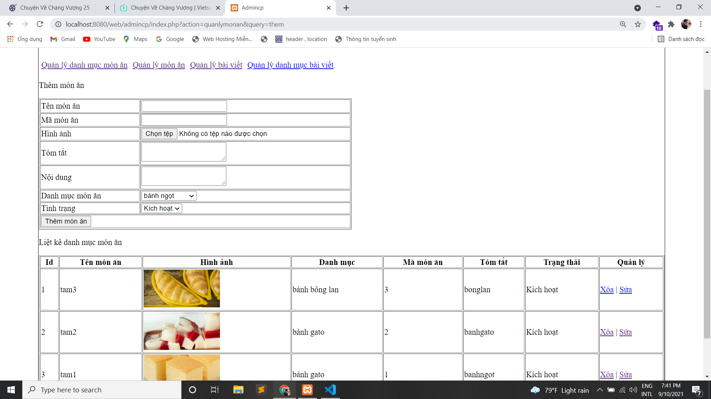

## Báo cáo: Xây dựng website "Hướng dẫn nấu ăn"
1. Tuần 1: Thiết kế giao diện trang chủ bằng html và css

2. Tuần 2_3: Xây dựng trang admincp
#### Quản lý danh mục món ăn
* Thêm
* Xóa 
* Sửa

2. Tuần 4: Xây dựng trang admincp
#### Quản lý món ăn
* Danh mục
* Mã món ăn
* Tóm tắt
* Trạng thái
* Quản lý
    * Xóa 
    * Sửa
